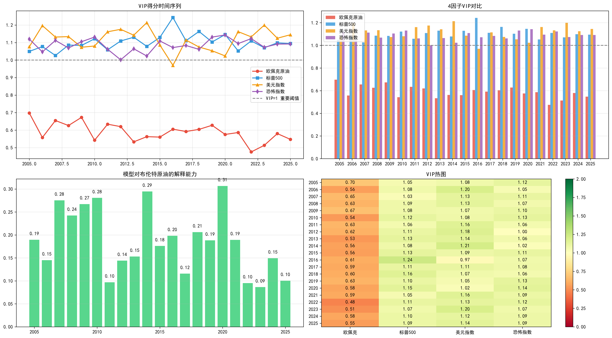
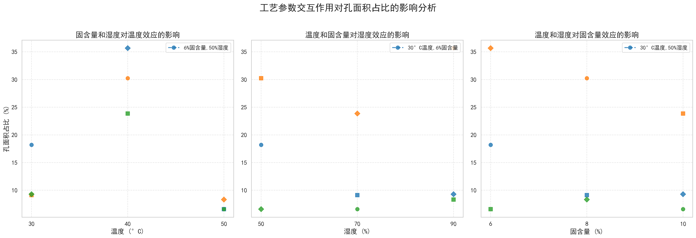
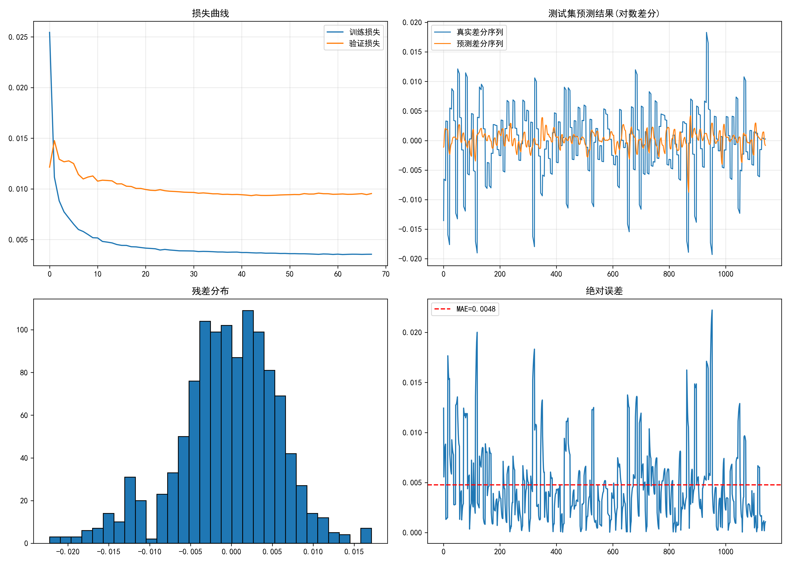
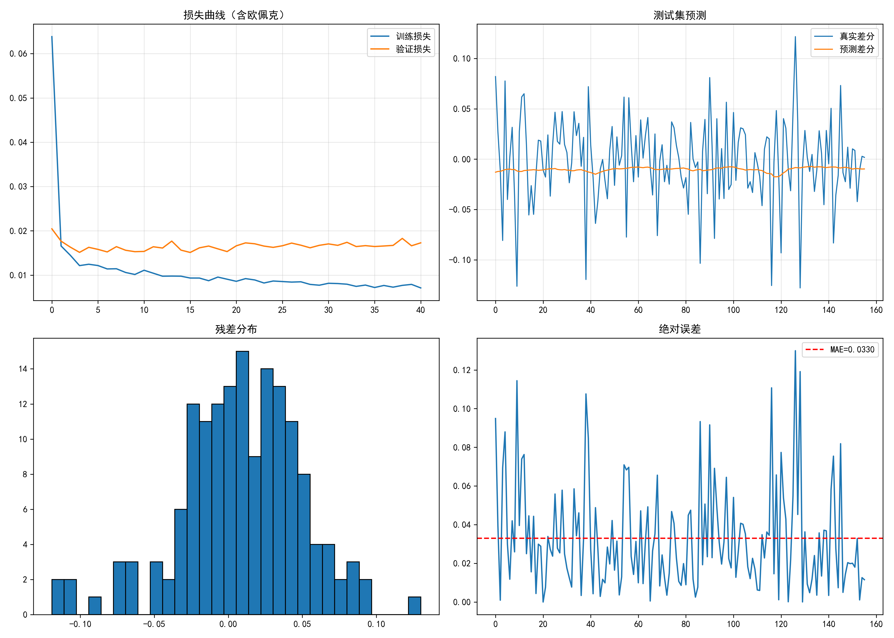
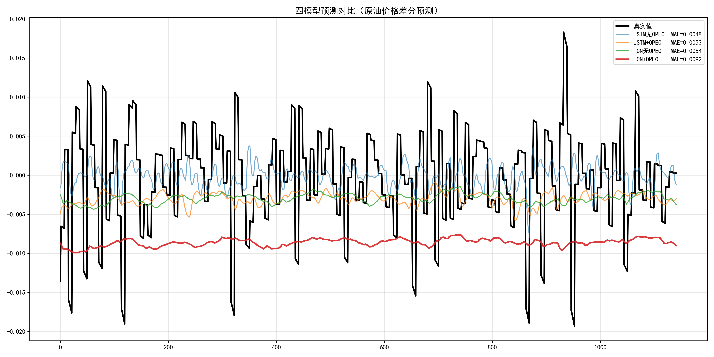

# URP：布伦特原油预测与影响因素分析

本项目围绕伦敦布伦特原油期货，探索外部因子的重要性，以及不同因子组合下的时序预测表现。现有目录保留了研究代码、历史实验输出

### 1. 因子筛选：金融因子主导，OPEC 为弱因子

采用稳健 PLS-OHLC + VIP 方法量化因子贡献度。VIX 恐慌指数、标普500、美元指数的 VIP 值均大于 1，是驱动油价波动的核心金融因子；OPEC 原油产量的 VIP 值小于 1，属弱供给因子。

### 2. 对照实验：剔除 OPEC 的 VIP 筛选模型更优

设置全因子模型（4 变量）与 VIP 筛选模型（剔除 OPEC、保留 3 项核心金融因子）双组对照。弱因子会引入噪声、增加冗余维度，剔除后模型预测效果与稳定性提升。

### 3. 模型对比：LSTM 总体优于 TCN

相同条件下，LSTM 模型总体误差指标更优，TCN 在长期趋势追踪与短期波动拟合上各有适配场景；结合 VIP 精简因子后，LSTM 的优化效果更明显。

## 已完成的工作

1. 整理布伦特原油、VIX、标普500、美元指数和 OPEC 相关 Excel/CSV 数据，编写日期对齐、缺失值处理、归一化与滑动窗口处理流程。
2. 实现 OHLC 变换、自编稳健 PLS 和按年度计算的 VIP 分析，分别比较三个金融因子及加入 OPEC 后的四因子组合。
3. 实现三因子 LSTM、四因子 LSTM、四因子 TCN 风格的因果膨胀卷积模型，以及 LSTM/TCN × 含/不含 OPEC 的四组统一对比。
4. 保存预测曲线、误差对比、残差图、VIP 图及部分模型权重、预测数组和指标。
5. 保留 CNN-LSTM、DenseNet-TCN、价格水平预测、六模型对比等探索版本，以及结题报告。

核心预测脚本预测的是原油收盘值的**对数一阶差分**，不是直接输出以货币计量的油价。三因子指 VIX、标普500和美元指数；四因子在此基础上加入 OPEC 数据。

## 文件导航

| 位置 | 用途 |
| --- | --- |
| `核心代码/VIP因子分析_三因子.py`、`VIP因子分析_四因子.py` | 年度因子重要性分析 |
| `核心代码/LSTM_三因子最终版.py`、`LSTM_四因子含OPEC.py` | 两种特征组合的 LSTM 实验 |
| `核心代码/TCN_四因子最终版.py` | 四因子因果膨胀卷积实验 |
| `核心代码/模型综合对比.py` | 同一数据流程下训练和比较四组模型 |
| `废弃代码/` | 历史探索版本，不作为默认入口 |
| `可视化/` | 历史图表，部分与核心代码目录中的图表并存 |
| `数据/` | 原始数据（布伦特原油价格与 VIX/标普500/美元指数/OPEC 四类因子），已随仓库提交 |
| `模型输出/` | 本地历史权重、数组、指标与检查点，默认不提交 |
| `项目文档/` | 原始结题材料，含个人信息，默认不提交 |

## 复现前须知

- 原 `requirements.txt` 为现有环境清单，缺少核心预测脚本使用的 TensorFlow，尚不是经过验证的安装方案；此次保留原样。
- 核心脚本使用 `../数据/` 相对路径，现状要求以 `核心代码` 为工作目录；历史脚本的路径规则不同。
- 输入文件名应与代码一致。预测脚本要求 `Date`、`close`；VIP 脚本按列位置重命名为 `Date/Open/High/Low/Close`，因此必须先检查列顺序与真实字段意义。
- 脚本会执行训练、显示图表，并可能覆盖同名输出；不要直接导入这些脚本来做语法检查。
- 中文图表依赖本机的 SimHei 字体。
- 数据已随仓库提交至 `数据/`；核心脚本以 `核心代码` 为工作目录，通过 `../数据/` 读取。

## 结论边界

现有材料足以说明已完成一条“数据处理—因子分析—模型实验—结果展示”的研究流程，但不能据此确认某个模型或因子组合已被严格证明最优。数据泄漏、OPEC 字段含义、实验口径和结果溯源问题解决后，需要重新评估。

本项目用于研究记录，不作为投资决策依据。第三方数据与参考研究不因上传此目录而获得再分发授权；尚未添加开源许可证。
